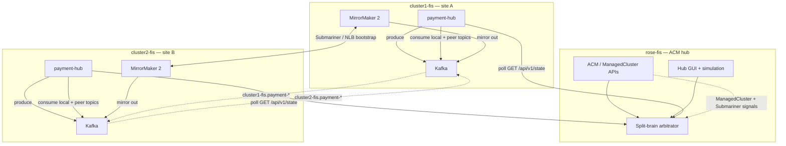
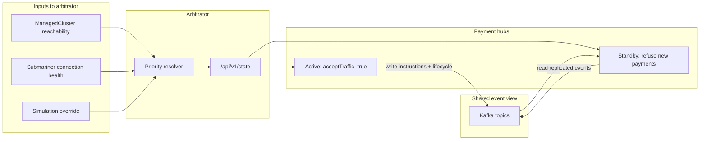
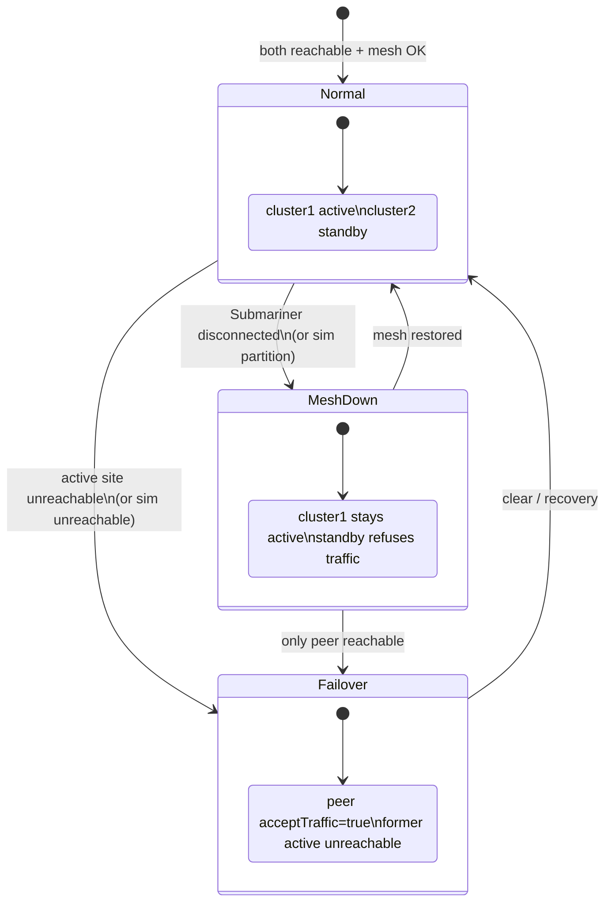
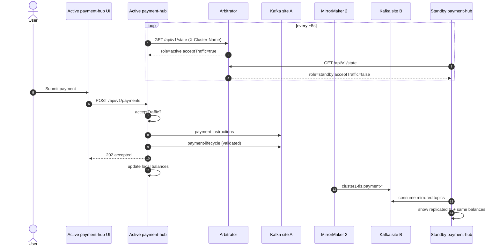
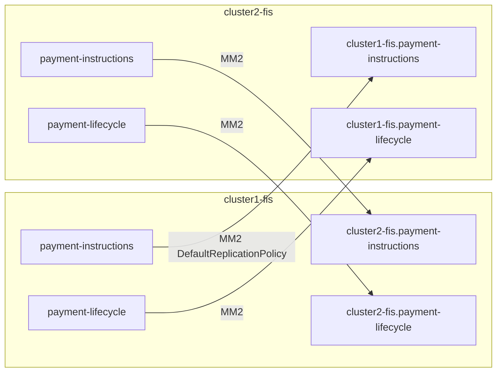
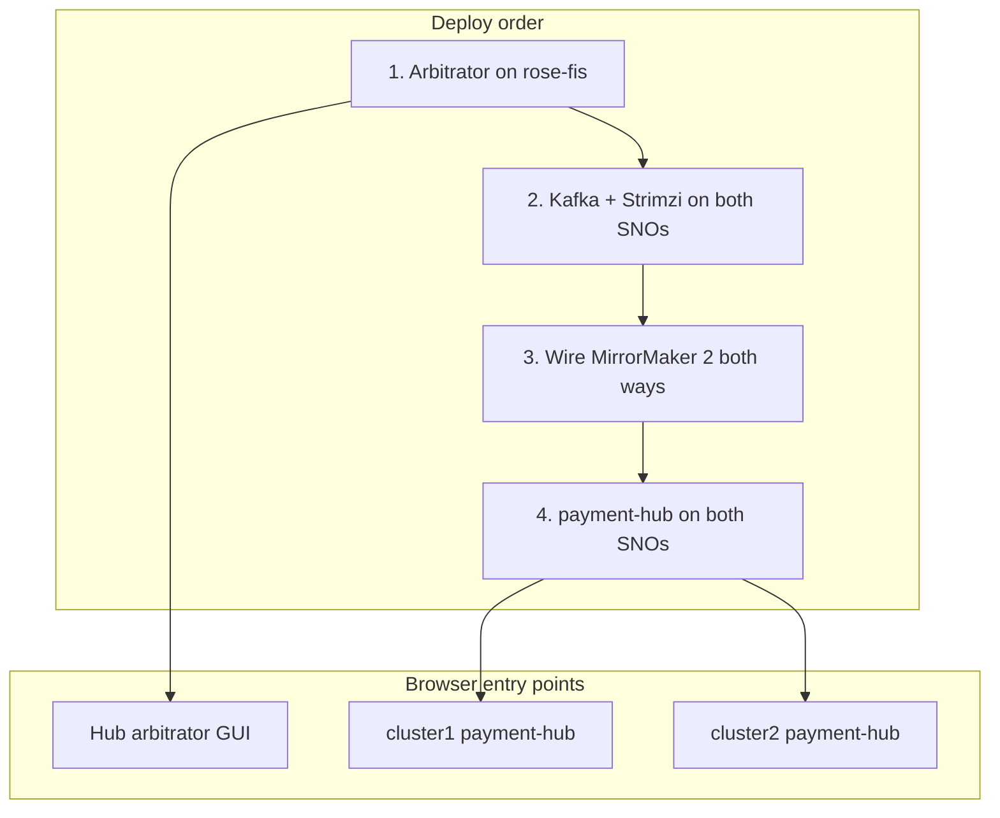
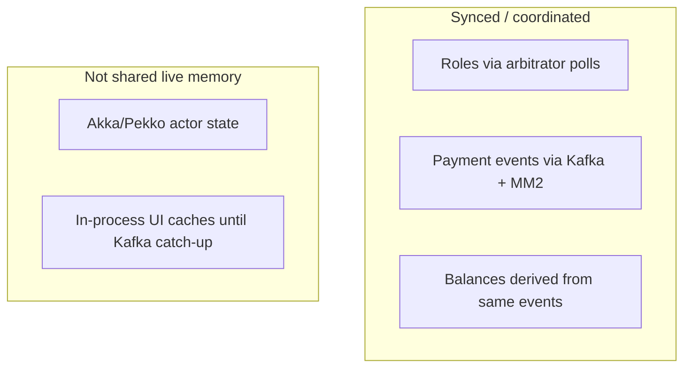

# FIS dual-site payment demo — how it works

This lab shows **two independent payment sites** (not one stretched Akka cluster) on OpenShift, with **ACM as a third-site arbitrator** for active/standby, and **Kafka + MirrorMaker 2** for async transaction sync.

```text
Active site accepts payments → Kafka events → MM2 mirrors to standby
Arbitrator (hub) tells each site whether it may acceptTraffic
```

---

## Technology map

| Layer | Technology | Role |
|-------|------------|------|
| Hub cluster | OpenShift + **ACM** (`rose-fis`) | Manages SNOs; hosts arbitrator |
| Managed sites | OpenShift **SNO** (`cluster1-fis`, `cluster2-fis`) | Independent payment DCs |
| Connectivity | **Submariner** | Cross-cluster mesh / reachability signal |
| Arbitrator | **Go** service `akka-split-brain-arbitrator` | Active / standby / unreachable decisions |
| Payment app | **Go** `payment-hub-demo` | Polls arbitrator; accepts payments; ledger UI |
| Event bus | **Apache Kafka** (Strimzi) | Local site event log |
| Replication | **MirrorMaker 2** | Async copy of payment topics peer ↔ peer |
| Demo control | Arbitrator **simulation API** + hub GUI | Failover without breaking real mesh |

---

## Big picture



---

## Components and responsibilities



---

## Active / standby decision

Priority order (config): `cluster1-fis` → `cluster2-fis`.

| Condition | cluster1 | cluster2 |
|-----------|----------|----------|
| Healthy mesh, both reachable | **active** | standby |
| Mesh down, both reachable | **active** (priority) | standby |
| cluster1 unreachable | unreachable | **active** |
| cluster2 unreachable | **active** | unreachable |



Standby is healthy and warm via Kafka.

---

## Payment transaction path

How a real-ish dual-DC payment is mimicked:



**Balances** are derived on each site from validated lifecycle events (start at 1000 USD per user): debit `from`, credit `to`. Because both sites see the same Kafka stream (local or mirrored), totals stay aligned.

---

## Demo failover (simulation)

Simulation does **not** tear down Submariner; it overrides what the arbitrator reports so apps react by polling.

```mermaid
sequenceDiagram
  participant Demo as Operator / Hub GUI
  participant Arb as Arbitrator
  participant C1 as cluster1 payment-hub
  participant C2 as cluster2 payment-hub

  Note over C1,C2: Normal: C1 active, C2 standby

  Demo->>Arb: PUT /api/v1/simulation<br/>mode=unreachable target=cluster1-fis
  Arb->>Arb: effective: C1 down, mesh down

  C1->>Arb: GET /api/v1/state
  Arb-->>C1: role=unreachable acceptTraffic=false
  C2->>Arb: GET /api/v1/state
  Arb-->>C2: role=active acceptTraffic=true

  Note over C2: New payments accepted on cluster2
  Note over C1: Refuses; may still show ledger from Kafka

  Demo->>Arb: PUT mode=none
  Note over C1,C2: Priority active restored on cluster1
```

| Simulation button | Meaning |
|-------------------|---------|
| Clear (live signals) | Use real ACM / Submariner |
| Submariner mesh down | Partition only; priority active stays |
| Mark cluster N unreachable | Failover to peer |

---

## Kafka topic layout



Topic regexes are anchored (`^payment-instructions$|^payment-lifecycle$`) so bidirectional MM2 does not create feedback loops.

---

## Deploy topology (lab)



| Component | Typical URL |
|-----------|-------------|
| Arbitrator | `https://akka-split-brain-arbitrator-open-cluster-management.apps.rose-fis.opdev.io/` |
| Site A | `https://payment-hub-payment-hub.apps.cluster1-fis.opdev.io/` |
| Site B | `https://payment-hub-payment-hub.apps.cluster2-fis.opdev.io/` |

Scripts: `scripts/deploy-arbitrator.sh`, `deploy-kafka-site.sh`, `wire-mirrormaker2.sh`, `deploy-payment-hub.sh`.

---

## What is synced vs not



This matches a **dual-datacenter active/standby** payment design: the standby is warm on the event log, not a single stretched cluster.

---

## Repo map

| Path | What it is |
|------|------------|
| `akka-split-brain-arbitrator/` | Hub arbitrator + GUI |
| `payment-hub-demo/` | Per-site payment app + balances/transactions UI |
| `k8s/cluster1-fis/kafka/`, `k8s/cluster2-fis/kafka/` | Kafka + MM2 manifests |
| `docs/arbitrator-api-for-payment-hub.md` | APIs payment hubs call on the arbitrator |
| `docs/EDGE-CASES.md` | Edge-case test checklist |
| `scripts/` | Deploy helpers |

---

## Quick mental model

1. **ACM hub** watches managed clusters + Submariner.  
2. **Arbitrator** publishes who may take traffic.  
3. **Active payment-hub** accepts payments and writes Kafka.  
4. **MM2** copies events to the peer.  
5. **Standby payment-hub** refuses new payments but shows the same transactions and balances.  
6. On **failover** (real or simulated), the peer becomes active and continues from the replicated log.
