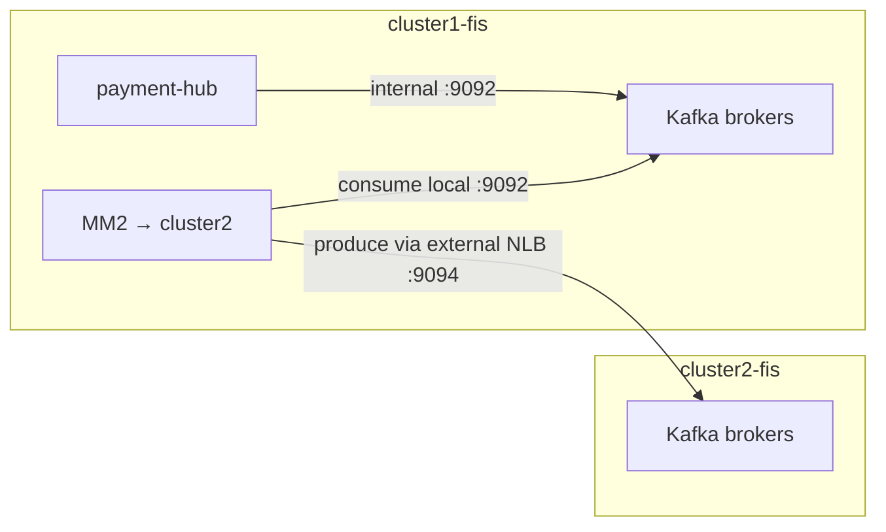
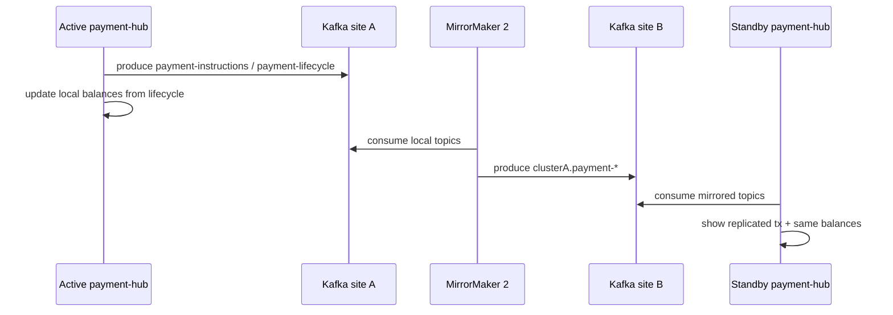

# Kafka and MirrorMaker 2 across two sites

How payment events move between `cluster1-fis` and `cluster2-fis`, what the **external bootstrap** is, and what happens when a site cannot receive data.

Related: [ARCHITECTURE-README.md](./ARCHITECTURE-README.md) (system overview), [EDGE-CASES.md](./EDGE-CASES.md) (MM2 pause tests).

---

## Big picture

Each OpenShift site runs its **own** Kafka cluster (Strimzi). They are **not** one stretched Kafka.

- The **active** payment-hub writes to **local** topics.
- **MirrorMaker 2 (MM2)** copies those topics to the peer asynchronously.
- Both payment-hubs **consume** local topics plus the peer’s mirrored (prefixed) topics so balances/transactions stay aligned when the link is healthy.

```text
Active site                         Standby site
┌──────────────────────┐           ┌──────────────────────┐
│ payment-hub          │           │ payment-hub          │
│        │             │           │        │             │
│        ▼             │           │        ▼             │
│ Kafka (local)        │  ─MM2─▶   │ Kafka (local)        │
│  payment-*           │           │  cluster1-fis.payment│
│  cluster2-fis.payment│  ◀─MM2─  │  payment-*           │
└──────────────────────┘           └──────────────────────┘
```

---

## Topics

| Topic | Purpose |
|-------|---------|
| `payment-instructions` | Payment create / instruction events |
| `payment-lifecycle` | Validated lifecycle (used for balances) |

On the **peer**, MM2 renames with the source cluster alias (DefaultReplicationPolicy):

| Source (local) | Appears on peer as |
|----------------|--------------------|
| `payment-instructions` | `cluster1-fis.payment-instructions` (or `cluster2-fis.…`) |
| `payment-lifecycle` | `cluster1-fis.payment-lifecycle` (or `cluster2-fis.…`) |

Topic regexes in MM2 are **anchored** (`^payment-instructions$|^payment-lifecycle$`) so prefixed remote copies are **not** mirrored again (avoids a feedback loop).

---

## Two listeners: internal vs external bootstrap

Each Kafka CR defines two listeners:

| Listener | Port | Type | Who uses it |
|----------|------|------|-------------|
| `plain` | `9092` | `internal` | Clients **inside** the same OpenShift cluster (payment-hub, local MM2 source side) |
| `external` | `9094` | `loadbalancer` | Clients **outside** that cluster (peer MM2) |

### Internal bootstrap

```text
kafka-cluster-kafka-bootstrap.kafka.svc.cluster.local:9092
```

Only resolvable inside that site’s cluster network.

### External bootstrap

This is the address a **remote** client uses to reach that site’s Kafka.

- Declared in `k8s/cluster*-fis/kafka/01-kafka-cluster.yaml` as listener `external` / `type: loadbalancer`.
- On AWS, Strimzi/OpenShift provisions an **NLB**; the hostname:port is written into the Kafka status.
- Read it with:

```bash
oc -n kafka get kafka kafka-cluster \
  -o jsonpath='{.status.listeners[?(@.name=="external")].bootstrapServers}{"\n"}'
```

Example shape (values change if the load balancer is recreated):

```text
xxxxxxxxxxxxxxxxxxxxxxxxxxxxxxxx-nnnnnnnnnn.us-east-1.elb.amazonaws.com:9094
```

`scripts/wire-mirrormaker2.sh` reads both sites’ external bootstraps and substitutes:

- `CLUSTER2_FIS_EXTERNAL_BOOTSTRAP` into cluster1’s MM2 manifest  
- `CLUSTER1_FIS_EXTERNAL_BOOTSTRAP` into cluster2’s MM2 manifest  

So MM2 on site A can open a Kafka client connection to site B’s brokers (and vice versa).



---

## How MM2 is wired in this lab

Two **one-way** `KafkaMirrorMaker2` resources (together = bidirectional):

| Runs on | Resource | Source → target |
|---------|----------|-----------------|
| cluster1-fis | `mm2-to-cluster2-fis` | cluster1 → cluster2 |
| cluster2-fis | `mm2-to-cluster1-fis` | cluster2 → cluster1 |

Strimzi rule used here: `connectCluster` equals the **target** cluster alias, so Connect’s internal topics live on the target Kafka (with RF=1 for SNO).

MM2 is Kafka Connect under the hood:

1. Source connector consumes from source bootstrap (local internal).
2. Produces into target bootstrap (peer **external**).
3. Tracks offsets so it can resume after restarts or outages.

Manifests: `k8s/cluster1-fis/kafka/03-mirrormaker2.yaml`, `k8s/cluster2-fis/kafka/03-mirrormaker2.yaml`.

---

## What happens when one cluster cannot receive

MM2 is **asynchronous**. It does **not** make the active site wait for the peer to acknowledge each message.

| Situation | Behavior |
|-----------|----------|
| Peer Kafka / NLB unreachable | Active keeps writing to **local** Kafka. MM2 retries and lags. Mirrored topics on the peer stop advancing. |
| Peer recovers | MM2 resumes from last committed offsets and **catches up**. Standby eventually sees missed events. |
| Active site Kafka down | No new durable events at that site. Peer MM2 pulling *from* it stalls for that direction. |
| ACM / arbitrator marks site unreachable | Changes **who may accept payments**. Separate from MM2 health — Kafka link may still work, or not. |

### Implications

1. **Eventual consistency** — standby UI/balances can lag while the link is down.
2. **Active durability** — if the active site’s local Kafka stayed up, events are safe there even if the peer was offline.
3. **Data-loss window** — if the active site’s Kafka is destroyed before MM2 copied messages, the peer never gets them (classic async DR tradeoff).
4. **After failover** — the new active writes to **its** local topics; the reverse MM2 path mirrors them back when the other site is reachable again.

Arbitrator simulation (`unreachable` / mesh down) does **not** by itself stop MM2; use scaling MM2 or breaking the NLB path to demo replication lag (see [EDGE-CASES.md](./EDGE-CASES.md) H2 / I3).

---

## End-to-end payment path (healthy link)



---

## Quick reference commands

```bash
# External bootstraps
oc --kubeconfig "$CLUSTER1_KUBECONFIG" -n kafka get kafka kafka-cluster \
  -o jsonpath='{.status.listeners[?(@.name=="external")].bootstrapServers}{"\n"}'
oc --kubeconfig "$CLUSTER2_KUBECONFIG" -n kafka get kafka kafka-cluster \
  -o jsonpath='{.status.listeners[?(@.name=="external")].bootstrapServers}{"\n"}'

# MM2 status
oc --kubeconfig "$CLUSTER1_KUBECONFIG" -n kafka get kafkamirrormaker2
oc --kubeconfig "$CLUSTER2_KUBECONFIG" -n kafka get kafkamirrormaker2

# Apply MM2 with live bootstraps
./scripts/wire-mirrormaker2.sh

# List topics (include mirrored)
oc --kubeconfig "$CLUSTER2_KUBECONFIG" -n kafka exec kafka-cluster-kafka-0 -c kafka -- \
  bin/kafka-topics.sh --bootstrap-server localhost:9092 --list
```

---

## Mental model

| Question | Answer |
|----------|--------|
| Shared Kafka across sites? | No — two clusters |
| Sync or async? | Async MM2 |
| How does peer MM2 find the other Kafka? | **External bootstrap** (NLB `:9094`) |
| How do apps on the same site find Kafka? | **Internal** Service `:9092` |
| Peer down — do active payments still work? | Yes, if local Kafka is up; peer catches up later |
| Who decides active/standby? | Arbitrator (ACM), not MM2 |
